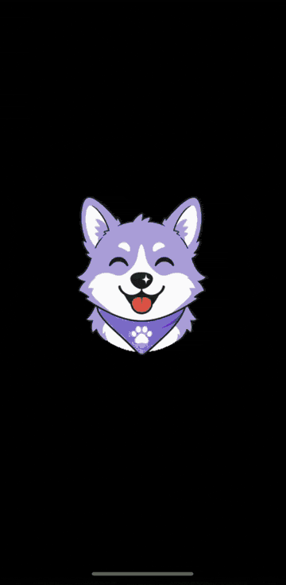

# False Positive Scout



Point your iPhone at things your Roboflow object detector wrongly “sees.” Scout runs **your** Core ML model live on device, saves frames **only while you hold the shutter**, lets you swipe-review them, and uploads the mistakes you keep back to that model’s Roboflow project as **null (empty) images** so the next train learns “this is not a stick.”

Hard-negative mining you can do while walking around the house.

There is **no TestFlight or App Store build**. You try Scout by cloning this repo and sideloading with your own Xcode + Apple ID. Never paste an API key into Scout — auth is OAuth only.

## Demo

- **GIF (README hero):** [`docs/media/scout-demo.gif`](docs/media/scout-demo.gif) — *placeholder; asset landing separately*
- **Video:** [`docs/media/scout-demo.mp4`](docs/media/scout-demo.mp4) — *placeholder; 30–45s walkthrough landing separately*

## Requirements

- Mac with **Xcode 26+** (built and verified with Xcode 26.x toolchains)
- iPhone on **iOS 16.0+** (deployment target; camera required — Simulator builds but cannot capture)
- Roboflow account with a trained **object-detection** version that exposes a Core ML export (`GET /coreml/{project}/{version}`)
- Apple ID for signing (Personal Team / free account works; free-team installs typically need re-signing about every **7 days**)
- **Models:** Only **RF-DETR** Core ML exports have been tested end-to-end. A Vision/YOLO backend also exists in code but is **not** claimed as verified.

## How to try it (sideload)

1. `git clone https://github.com/pmn4/false-positive-scout.git && cd false-positive-scout`
2. Copy the **required** signing template (the build fails closed if it is missing):
   ```bash
   cp Config/Secrets.xcconfig.example Config/Secrets.xcconfig
   ```
3. Edit `Config/Secrets.xcconfig`: set `DEVELOPMENT_TEAM` to your Team ID and `PRODUCT_BUNDLE_IDENTIFIER` to a **unique** id (e.g. `com.yourname.falsepositivescout`).
4. **Optional:** copy `Config/Secrets.plist.example` → `Config/Secrets.plist` for default workspace/project, or to override the baked-in public OAuth client ID. Builds succeed without this file.
5. Open `Scout.xcodeproj` in Xcode, plug in your iPhone, Run.
6. In **Settings**, tap **Log in with Roboflow**, approve consent, then pick workspace → project → model version; Scout downloads and caches the Core ML package.

Simulator compile check (no signing / no camera):

```bash
xcodebuild -project Scout.xcodeproj -scheme Scout -configuration Debug \
  -destination 'platform=iOS Simulator,name=iPhone 17' \
  CODE_SIGNING_ALLOWED=NO build
```

## Auth

**Log in with Roboflow** uses OAuth 2.1 + PKCE (public client, `token_endpoint_auth_method: none`, no client secret). Access and refresh tokens live in Keychain. Sign-out revokes then clears. There is **no API-key path** in the app.

Roboflow documents open Dynamic Client Registration primarily for MCP clients. Native-app PKCE works today (verified Oct 2026) but is not officially documented for third-party iOS apps. Scout ships a public client ID; you can override it via optional `Secrets.plist` if you register your own.

## Flow

1. **Scout** — Live preview with boxes. Detection runs continuously (~10 Hz). **Frames are saved only while you hold the shutter** (UI: “Hold button to save frames”). A frame is kept if it has detections **and** it is the first save in this hold, has more objects of some class than the last save, or looks different enough (8×8 perceptual hash; skip if similarity &gt; 0.85). Each capture stores the model `workspace/project` and version that produced it.
2. **Review** — Swipe right = keep (false positive / null candidate), left = reject. Long-press fades boxes to inspect the raw frame. Undo is available.
3. **Upload & Nullify** — Groups kept frames by target project, uploads each group as a zip into a shared batch named `Scout - yyyy-MM-dd HH:mm`, null-annotates every image, then offers **Open in Roboflow** links (one per project/batch) that open Safari.

### When to swipe right

**Only keep frames with zero real objects of any class your project cares about.** A frame with a real stick (or ball, etc.) that the model missed is a **missing annotation**, not a null — nulling it teaches the model to ignore real objects. See Roboflow’s [Missing vs. Null Annotations](https://blog.roboflow.com/missing-and-null-image-annotations/).

### What Upload & Nullify does

Code paths in `FrameReviewView` / `RoboflowService`:

1. Resolves target project = `frame.modelProject` ?? currently selected `scout_model_project`.
2. Checks that project exists via `listProjects` for its workspace; skips with an error if not.
3. Groups frames by project. For each project, builds JPEGs named `scout_<yyyyMMdd_HHmmss>_<shortid>.jpg`, zips them under `train/`, and uploads via:
   - `POST /{workspace}/{project}/upload/zip` (Bearer) → `PUT` to the returned signed URL → poll `GET /{workspace}/upload/zip/{taskId}` → search to resolve image ids.
   - Batch name: `Scout - yyyy-MM-dd HH:mm` (one batch name per upload session; one zip/batch per project). Tag: `scout`.
4. Annotates null via `POST /{workspace}/{project}/annotate/{imageId}` with `name=annotation.coco.json` and the COCO fake-annotation workaround (see gotchas).
5. On the Upload Complete screen, shows **Open in Roboflow** — one Safari link per uploaded project, labeled with project + batch name. Prefers the Annotate batch page (`https://app.roboflow.com/{ws}/{project}/annotate/batch/{batchId}`); falls back to the project Annotate page if the batch id cannot be resolved.
6. Deletes the local frame on full success. Partial failures can retry nullify only.

**Why zip?** The legacy single-image `POST /dataset/.../upload` endpoint returns **HTTP 500 for OAuth Bearer tokens** (it still works with API keys). Scout therefore uses the zip + signed-URL flow for OAuth.

## Architecture (`Scout/`)

| File | Role |
|------|------|
| `ScoutApp.swift` / `ContentView.swift` | App entry, tabs |
| `CameraView.swift` | Camera, detect loop, hold-to-capture, overlay |
| `ModelManager.swift` | Download/cache Core ML, RF-DETR + Vision backends, labels/colors |
| `ModelPickerSheet.swift` | Workspace / project / version picker |
| `ThresholdManager.swift` / `ThresholdControlSheet.swift` | Global + per-class confidence |
| `FrameReviewView.swift` | Swipe deck + Upload & Nullify sheet (incl. Open in Roboflow) |
| `RoboflowService.swift` | REST: list, zip upload, annotate-as-null, batch deep links |
| `Models.swift` | `Detection`, `CapturedFrame` (`modelProject` / `modelVersion`) |
| `SettingsView.swift` | Log in / Log out, model selection |
| `OAuthManager.swift` | ASWebAuthenticationSession + PKCE; tokens in Keychain; refresh + revoke |
| `ScoutLog.swift` | Decision logs always; per-frame / upload verbose gated (`DEBUG`) |
| `Config/Scout.xcconfig` + `Secrets.*` | Signing/bundle via **required** gitignored `Secrets.xcconfig`; **optional** `Secrets.plist` defaults |

## Roboflow gotchas we learned

- **RF-DETR class order** comes from `GET /coreml/{project}/{version}` → `classes`. Index **0 is background** — skip `background_class*`.
- **Colors** from `/coreml` can be shifted; take colors **by class name** from the project endpoint.
- **Preprocessing** (Stretch vs letterbox) comes from version/model metadata; wrong mode misplaces boxes.
- **Null annotation:** empty COCO `annotations: []` is rejected. Match the Python SDK: include `info` / `licenses` / `categories`, a fake annotation whose `image_id` matches no image, body `{ "annotationFile": <coco>, "labelmap": null }`, query `name=annotation.coco.json`. Upload `name` must equal COCO `file_name`.
- **OAuth + single-image upload:** `POST /dataset/{project}/upload` 500s with Bearer tokens — use zip upload instead.

## Privacy & signing

- OAuth access/refresh tokens stay in Keychain. Do not commit tokens, `.env`, or footage of people (especially kids).
- `Config/Secrets.xcconfig` is gitignored and **required** (build fails if missing). `Config/Secrets.plist` is **optional**.
- Never commit real Team IDs, bundle IDs, or tokens. The examples use placeholders only.

## License

MIT — Copyright (c) 2026 Scout Contributors.
